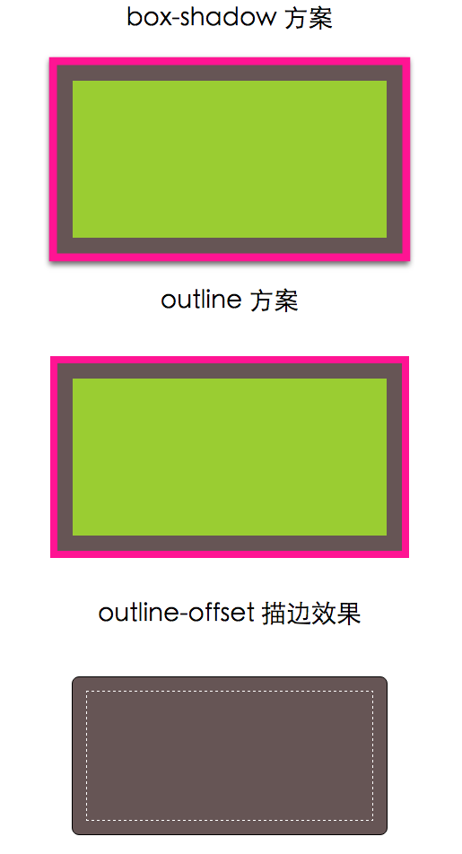

##NOTES

### box-shadow 方案

box-shadow可以接受第四个参数（称作“扩张半径”），通
过指定正值或负值，可以**让投影面积加大或者减小**。一个正值的扩张半径加
上两个为零的偏移量以及为零的模糊值，得到的“投影”其实就像一道实线
边框。

box-shadow 的好处在于，**它支持逗号分隔语法，我们
可以创建任意数量的投影**。

>投影的行为跟边框不完全一致，因为它不会影响布局，而且也不会
受到 **box-sizing** 属性的影响。不过，你还是可以通过内边距或外边
距（这取决于投影是内嵌和还是外扩的）来额外模拟出边框所需要
占据的空间。

>上述方法所创建出的假“边框”出现在元素的外圈。它们并不会响
应鼠标事件，比如悬停或点击。如果这一点非常重要，你可以给
**box-shadow** 属性加上 **inset** 关键字，来使投影绘制在元素的内圈。
请注意，此时你需要增加额外的内边距来腾出足够的空隙。

### outline 方案

可以通过 outline-offset 属性来控制它跟
元素边缘之间的间距，这个属性可以接受负值,这对于某些效果来说非
常有用,例如简单的缝边效果.

>outline只适用于双层“边框”的场景，因为 outline 并不能
接受用逗号分隔的多个值。如果我们需要获得更多层的边框，前一
种方案就是我们唯一的选择了。

>边框不一定会贴合 border-radius 属性产生的圆角，因此如果元素
是圆角的，它的描边可能还是直角的。请注意，这种行
为被 CSS 工作组认为是一个 bug，因此未来可能会改为贴合 borderradius
圆角。

>根据 CSS 基本 UI 特性（第三版）规范 (http://w3.org/TR/css3-ui) 所
述，“描边可以不是矩形”。尽管在绝大多数情况下，描边都是矩形
的，但如果你想使用这个方法，请切记：最好在不同浏览器中完整
地测试最终效果。

