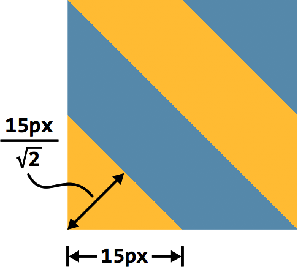

##NOTES

>“如果多个色标具有相同的位置，它们会产生一个无限小的过渡区域，
过渡的起止色分别是第一个和最后一个指定值。从效果上看，颜色会在那
个位置突然变化，而不是一个平滑的渐变过程。”
——CSS 图像（第三版）（ http://w3.org/TR/css3-images ）

>“如果某个色标的位置值比整个列表中在它之前的色标的位置值都要
小，则该色标的位置值会被设置为它前面所有色标位置值的最大值。”
——CSS 图像（第三版）（ http://w3.org/TR/css3-images ）

###斜向条纹

```
background: linear-gradient(45deg,
            #fb3 25%, #58a 0, #58a 50%,
            #fb3 0, #fb3 75%, #58a 0);
background-size: 30px 30px;
```



###更好的斜向条纹

一个鲜为人知的真
相是 linear-gradient() 和 radial-gradient() 还各有一个循环式的加强
版：**repeating-linear-gradient()** 和 **repeating-radial-gradient()**。
它们的工作方式跟前两者类似，只有一点不同：色标是无限循环重复的，直
到填满整个背景

```
background: repeating-linear-gradient(45deg, 
            #fb3, #58a 30px);
```

它相当于下面这个简单的线性渐变：

```
background: linear-gradient(45deg,
            #fb3, #58a 30px,
            #fb3 30px, #58a 60px,
            #fb3 60px, #58a 90px,
            #fb3 90px, #58a 120px,
            #fb3 120px, #58a 150px, ...);
 ```